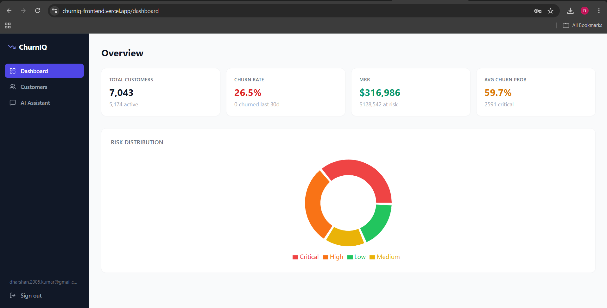
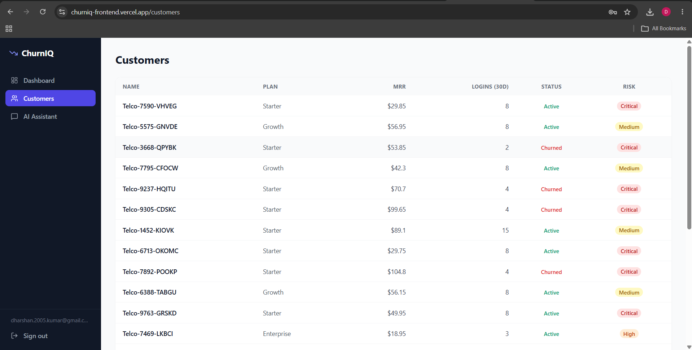
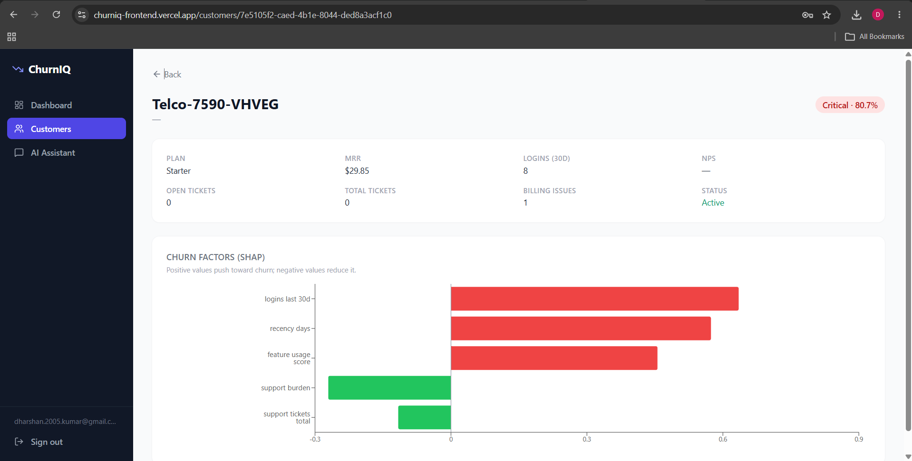
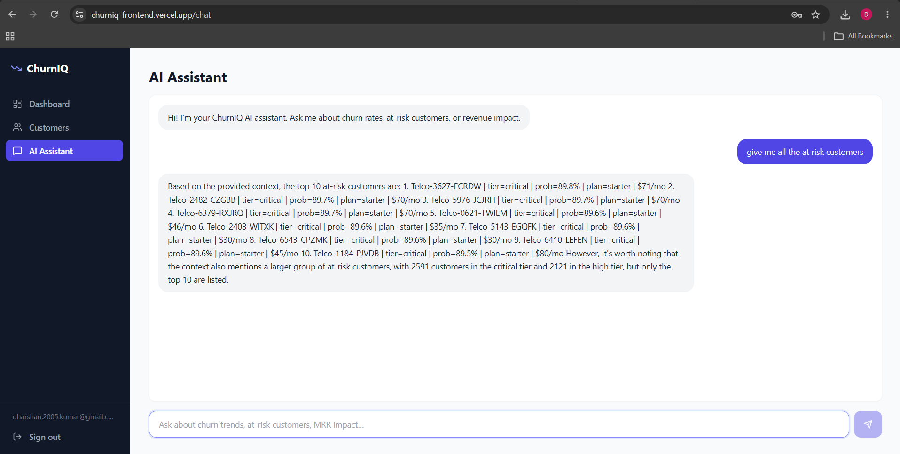

# ChurnIQ — Multi-tenant SaaS Churn Prediction Platform

Predict which customers are about to leave before they do. ChurnIQ combines a production-grade FastAPI backend, an XGBoost ML pipeline with SHAP explainability, and a React dashboard — all deployed and shareable as a live demo.

---

## Live Demo

| Service | URL |
|---|---|
| Frontend | https://churniq-frontend.vercel.app |
| Backend API | https://churniq-backend-nomu.onrender.com |

> **Note:** The backend runs on Render's free tier and may take **30–50 seconds to cold-start** on first load. The Swagger API docs are disabled in production (enabled only when `DEBUG=True`).

---

## Key Features

- **JWT Authentication** — register/login with rotating HTTPOnly refresh tokens (15-min access, 7-day refresh, token reuse detection)
- **Multi-tenant Architecture** — every customer, prediction, and analytics snapshot is scoped to the authenticated user; no data leaks between accounts
- **Customer Management** — full CRUD + CSV bulk import with per-row validation and error reporting
- **XGBoost Churn Model** — 16 engineered features (RFM, engagement, tenure, contract), Optuna-tuned over 25 trials, AUC-ROC 0.918
- **SHAP Explainability** — per-prediction SHAP values surfaced as a horizontal bar chart so you know *why* a customer is at risk, not just *that* they are
- **Risk Tiering** — customers bucketed into Low / Medium / High / Critical with thresholds at 30 / 50 / 75% churn probability
- **Analytics Dashboard** — live churn rate, MRR, MRR-at-risk, and risk distribution donut chart
- **RAG AI Assistant** — context-aware chatbot powered by Groq (Llama-3.3-70b) grounded in your real analytics data; answers questions about churn trends, at-risk customers, and revenue impact
- **CI/CD** — GitHub Actions pipeline: lint → import check → Docker build on every push; deployed via Render (backend) and Vercel (frontend)

---

## Tech Stack

### Backend
| | |
|---|---|
| Framework | FastAPI 0.111, Python 3.11 |
| Database | PostgreSQL (Supabase), SQLAlchemy 2.0 async, asyncpg |
| Auth | python-jose (JWT), bcrypt 4.x |
| ML | XGBoost, scikit-learn, SHAP, Optuna, pandas, joblib |
| LLM | OpenAI SDK v2 → Groq (llama-3.3-70b-versatile) |
| Validation | Pydantic v2, pydantic-settings |

### Frontend
| | |
|---|---|
| Framework | React 18, TypeScript, Vite 5 |
| Styling | Tailwind CSS 3 |
| Charts | Recharts (donut + horizontal bar) |
| HTTP | Axios with request/response interceptors for token refresh |
| Routing | React Router v6 |
| Icons | Lucide React |

### DevOps
| | |
|---|---|
| Containers | Docker (multi-stage builds), docker-compose |
| CI | GitHub Actions |
| Backend deploy | Render (Docker) |
| Frontend deploy | Vercel |
| Database | Supabase (managed PostgreSQL) |

---

## Architecture

```
Browser (Vercel)
    │  JWT Bearer token
    ▼
FastAPI (Render)
    ├── /api/v1/auth        →  JWT issue / rotate / revoke
    ├── /api/v1/customers   →  CRUD + CSV import  (user-scoped)
    ├── /api/v1/predictions →  batch scoring + per-customer SHAP
    ├── /api/v1/analytics   →  snapshot aggregation + history
    └── /api/v1/chat        →  RAG: build context → Groq LLM
           │
           ├── SQLAlchemy async ORM → Supabase PostgreSQL
           │       customers  ──┐
           │       model_versions  ├── all rows tagged with user_id
           │       churn_predictions ─┘
           │
           └── ML pipeline (joblib artifact baked into Docker image)
                   Raw customer rows
                   → feature engineering (16 features: RFM, engagement, tenure, contract)
                   → XGBoost predict_proba
                   → SHAP TreeExplainer (batch)
                   → churn_probability + risk_tier + top_factors stored per customer
```

**Multi-tenancy** is enforced at the ORM layer — every query that touches customer or prediction data filters on `Customer.user_id == current_user.id`. No row-level security is needed in the DB because the application layer never issues cross-tenant queries.

**ML pipeline flow:** Feature engineering is deterministic and stateless (no fit at inference time). The trained `sklearn.Pipeline` (SimpleImputer → XGBClassifier) is serialised with joblib and baked into the Docker image. At scoring time the router loads the artifact, builds a feature matrix for all of the user's customers, calls `predict_proba` in one batch, then runs SHAP's `TreeExplainer` on the same batch.

---

## Screenshots

### Dashboard


### Customers Table


### Customer Detail + SHAP Chart


### AI Assistant


---

## Local Development

### Prerequisites
- Python 3.11
- Node 20
- A Supabase project (or any PostgreSQL instance)
- A Groq API key (free at [console.groq.com](https://console.groq.com))

### Option A — Run services directly

**Backend**

```bash
cd backend
python -m venv .venv
# Windows:
.venv\Scripts\activate
# macOS/Linux:
source .venv/bin/activate

pip install -r requirements.txt

cp .env.example .env
# Edit .env — fill in DATABASE_URL, SECRET_KEY, OPENAI_API_KEY

# Create tables (run once against your Supabase DB)
psql $DATABASE_URL -f schema.sql

uvicorn app.main:app --reload --port 8000
```

**Frontend**

```bash
cd frontend
npm install

cp .env.example .env
# .env contains: VITE_API_URL=http://localhost:8000

npm run dev
# Opens at http://localhost:5173
```

### Option B — Docker Compose (full stack)

```bash
# Ensure backend/.env is populated first
docker compose up --build
```

- Frontend: http://localhost:5173
- Backend: http://localhost:8000
- API docs (debug mode only): http://localhost:8000/docs

### Seeding data

A pre-converted CSV of the [Telco Customer Churn dataset](https://www.kaggle.com/datasets/blastchar/telco-customer-churn) (7,043 rows) is included at `backend/sample_data/telco_import.csv`. After registering an account:

```bash
curl -X POST http://localhost:8000/api/v1/customers/bulk-import \
  -H "Authorization: Bearer <your_token>" \
  -F "file=@backend/sample_data/telco_import.csv"

# Then score all customers
curl -X POST http://localhost:8000/api/v1/predictions/run \
  -H "Authorization: Bearer <your_token>"
```

---

## API Overview

| Group | Prefix | Key endpoints |
|---|---|---|
| Auth | `/api/v1/auth` | `POST /register` `POST /login` `POST /refresh` `GET /me` |
| Customers | `/api/v1/customers` | `GET /` `POST /` `PUT /{id}` `DELETE /{id}` `POST /bulk-import` |
| Predictions | `/api/v1/predictions` | `POST /run` `GET /{customer_id}` `GET /model-versions` |
| Analytics | `/api/v1/analytics` | `GET /summary` `POST /snapshot` `GET /snapshots` |
| Chat | `/api/v1/chat` | `POST /` |
| System | `/` `/health` | Health check and root |

All endpoints except `/health` and `/` require a `Bearer` token. All customer and prediction data is scoped to the authenticated user.

---

## Model Performance

| Metric | Score |
|---|---|
| AUC-ROC | **0.9179** |
| Accuracy | 0.8824 |
| Precision | 0.6604 |
| Recall | **0.9459** |
| F1 | 0.7778 |

**Training data:** 7,043 customers from the Telco Customer Churn dataset (Kaggle), 26.5% churn rate.

**16 engineered features** across four groups:
- *RFM-style:* `tenure_days`, `recency_days`, `logins_last_30d`, `monthly_revenue`
- *Support / friction:* `support_tickets_open/total`, `billing_issues_count`, `support_burden`, `open_ticket_ratio`
- *Engagement:* `feature_usage_score`, `nps_score`
- *Contract:* `contract_length_months`, `has_contract`, `days_to_contract_end`, `plan_ordinal`, `company_size_ordinal`

**Top predictors** (XGBoost gain): `logins_last_30d` (22.8%) · `support_tickets_total` (20.1%) · `recency_days` (10.4%) · `feature_usage_score` (9.9%)

Hyperparameters tuned with **Optuna** (TPE sampler, 25 trials, 5-fold stratified CV). High recall (94.6%) is intentional — in a churn-prevention context, missing an at-risk customer costs more than a false alarm.

---

## Project Structure

```
ChurnIQ/
├── backend/
│   ├── app/
│   │   ├── core/          # Config, database engine, JWT security
│   │   ├── models/        # SQLAlchemy ORM models (User, Customer, ModelVersion, etc.)
│   │   ├── routers/       # FastAPI route handlers (auth, customers, predictions, analytics, chat)
│   │   ├── schemas/       # Pydantic request/response schemas
│   │   └── services/
│   │       ├── ml/        # Feature engineering, training, SHAP explainability, Optuna tuning
│   │       ├── analytics.py
│   │       ├── csv_ingestion.py
│   │       └── rag.py
│   ├── ml/                # CLI training scripts (train.py, train_tuned.py)
│   ├── sample_data/       # Telco CSV + data generation scripts
│   ├── scripts/           # One-off utilities (import_telco_data.py)
│   ├── schema.sql         # Full DB schema (run once to initialise)
│   ├── requirements.txt
│   └── Dockerfile
│
├── frontend/
│   ├── src/
│   │   ├── api/           # Typed Axios wrappers (auth, customers, predictions, analytics, chat)
│   │   ├── components/    # Layout (sidebar), StatCard, ProtectedRoute
│   │   ├── context/       # AuthContext + AuthProvider
│   │   ├── hooks/         # useAuth (login/register/logout/session restore)
│   │   └── pages/         # Dashboard, Customers, CustomerDetail, Chat, Login, Register
│   ├── nginx.conf         # SPA fallback + asset caching
│   ├── vercel.json        # SPA rewrite rule for Vercel
│   └── Dockerfile
│
├── models/                # Trained model artifacts (joblib) — baked into Docker image
│   └── v20260612-xgb-v3/
│       ├── pipeline.joblib
│       └── metadata.json
│
├── docker-compose.yml     # Local full-stack: backend :8000, frontend :5173
├── .github/
│   └── workflows/
│       └── ci.yml         # Lint → type-check → Docker build on push
└── README.md
```

---

## Author

Built by **Dharshan Kumar** as a portfolio project demonstrating end-to-end ML system design: data pipeline, model training and explainability, production API, and modern frontend — all deployed and publicly accessible.

[GitHub](https://github.com/DharshanKumar-dk9947) · [LinkedIn](https://linkedin.com/in/) <!-- add your LinkedIn slug -->
